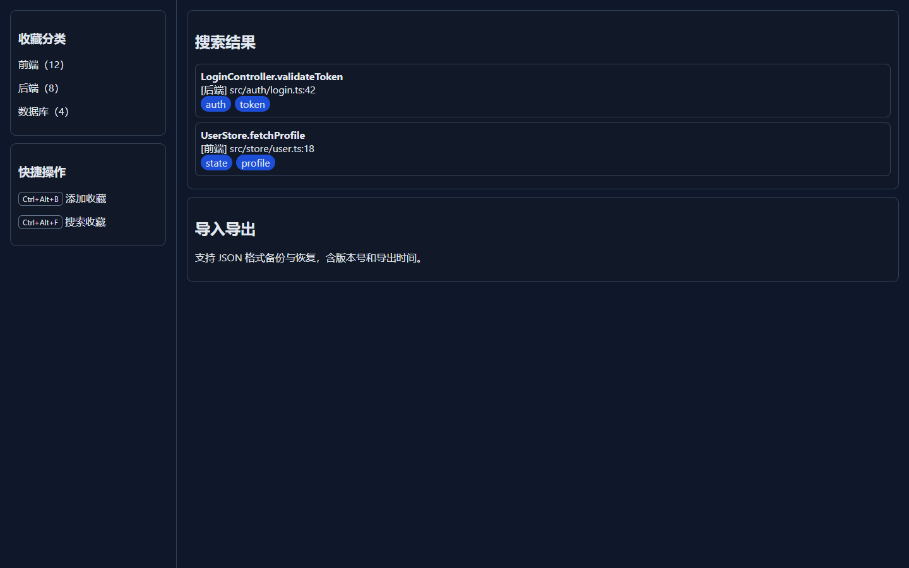

# Bookmark Catalog

[](https://github.com/weidaodeyinghuaji/vscode-bookmark-catalog/actions/workflows/ci.yml)




> 上图为与插件信息架构一致的交互原型预览，用于展示分类、搜索和导入导出流程。

一个面向 VS Code 的收藏管理插件，支持**分类、搜索、导入导出、快捷键、持久化**。

## 项目亮点

- 将书签领域逻辑、VS Code 存储适配和 TreeView 展示分层组织。
- 使用 JSON 版本字段校验导入数据，降低错误数据破坏本地收藏的风险。
- 通过 Vitest 覆盖收藏增删改查和 JSON 导入导出核心流程。
- GitHub Actions 在每次 push 和 pull request 时自动执行构建与测试。

## 功能

- 收藏当前位置（文件 URI + 行列号 + 分类 + 标签）
- 按标题/分类/标签/路径搜索
- TreeView 按分类展示收藏
- JSON 导入导出
- 快捷键：
  - `Ctrl+Alt+B`：添加收藏
  - `Ctrl+Alt+F`：搜索收藏
- 使用 VS Code `globalState` 持久化

## 快速开始

```bash
npm install
npm run build
npm run test
```

打包 VSIX：

```bash
npm run package
```

## 命令列表

- `bookmarkCatalog.addBookmark`
- `bookmarkCatalog.searchBookmarks`
- `bookmarkCatalog.manageBookmarks`
- `bookmarkCatalog.exportBookmarks`
- `bookmarkCatalog.importBookmarks`
- `bookmarkCatalog.refreshTree`

## 项目结构

```text
src/
  core/      # 领域逻辑：收藏管理与导入导出
  infra/     # 存储适配器（Memento）
  ui/        # TreeView
  extension.ts
tests/
docs/
```

## CI

GitHub Actions 在 push / pull_request 触发：

- 安装依赖
- 执行 `npm run build`
- 执行 `npm run test`

## 产物

- VSIX：`dist/bookmark-catalog.vsix`
- 测试覆盖率报告：`coverage/`
